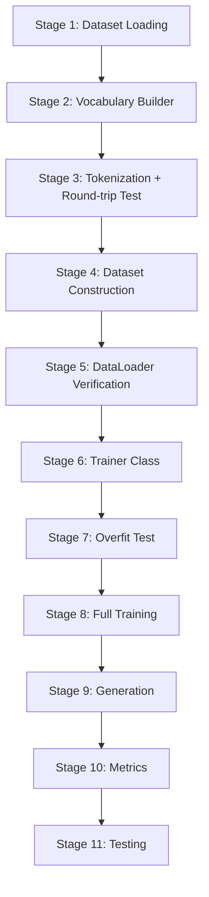

# TinyGPT Training Pipeline — Complete Plan

This document explains every stage of training TinyGPT on `TinyStories-valid.txt`, from raw text to generated output. Each section explains **what** happens, **why** it is necessary, and **how** we will implement it using existing TinyModelZ classes.

---

## Dataset Inspection Results

| Metric | Value |
|:---|:---|
| File size | 19.4 MB |
| Lines | 147,274 |
| Words | 3,775,641 |
| Characters | 19,447,297 |
| Unique characters | 98 |
| `<\|endoftext\|>` separators | 21,990 |
| Stories (approx) | ~21,990 |

The dataset is simple English text — mostly lowercase letters, spaces, punctuation, and a handful of rare Unicode characters (emoji, accented letters). This is ideal for a character-level tokenizer.

---

## Stage 1: Dataset Loading

### What
Read `TinyStories-valid.txt` as a single UTF-8 string into memory.

### Why treat it as one continuous stream?
GPT-family models are trained on a **single, flat sequence of tokens**. The model sees no "document boundaries" — it simply predicts the next token given the previous context window. Treating the file as one stream maximizes data utilization: the DataLoader can slide its window across story boundaries, and the model naturally learns that `<|endoftext|>` marks the end of one story and the beginning of another.

If we treated each story separately, we would:
- Waste tokens at story boundaries (padding shorter stories to `contextLength`)
- Lose the ability to learn the EOS transition pattern
- Complicate batching significantly

### The `<|endoftext|>` separator
This token appears 21,990 times — once between each story. Its purpose:

1. **Boundary signal**: Tells the model "the previous story is done, a new one starts." The model learns to reset its internal "narrative state" when it sees this token.
2. **Generation control**: During inference, when the model generates `<|endoftext|>`, we know it has finished producing a coherent story and we can stop.
3. **Attention masking**: Within a context window, if the window spans two stories, the EOS token naturally "dampens" attention from story B back to story A.

### Decision: EOS token vs. vocabulary token
It should be a **dedicated special token** with its own token ID. Reasons:
- It is not a natural character — it is a control signal
- It needs a stable, known ID so the `Generator` can stop on it
- It must participate in the vocabulary (the model must learn to *predict* it)

We will add `<|endoftext|>` as a special token in the `CharacterTokenizer` vocabulary.

### Implementation
- Read the file using `Files.readString(Path.of("TinyStories-valid.txt"))`
- Pass the entire string to `TextDataset`
- No preprocessing needed — the text is already clean

---

## Stage 2: Vocabulary & Tokenizer Selection

### Character-level tokenizer (our choice)

| Aspect | Assessment |
|:---|:---|
| **Vocabulary size** | ~98 unique chars + 5 special tokens + 1 EOS = ~104 tokens |
| **Sequence length** | Very long (19M characters = 19M tokens) |
| **Advantages** | Zero vocabulary design, no OOV tokens, lossless encode/decode, trivial to implement |
| **Disadvantages** | Long sequences mean the model must learn long-range dependencies; each "token" carries minimal semantic information |

### WordPiece tokenizer (existing in project)

| Aspect | Assessment |
|:---|:---|
| **Vocabulary size** | Configurable (typically 1K–30K) |
| **Sequence length** | ~4-5× shorter than character-level |
| **Advantages** | Shorter sequences, subword units carry more meaning, better for large models |
| **Disadvantages** | Requires pre-trained vocabulary (which we don't have for TinyStories); building one from scratch requires a merge algorithm |

### BPE (not yet implemented)

| Aspect | Assessment |
|:---|:---|
| **Vocabulary size** | Configurable |
| **Sequence length** | Similar to WordPiece |
| **Advantages** | Industry standard (GPT-2/3/4 use it) |
| **Disadvantages** | Requires implementing the merge learning algorithm — significant work |

### Decision
**Use the character-level tokenizer.** Reasons:
1. It already exists and works perfectly
2. For a tiny model on a tiny dataset, character-level is pedagogically clear
3. The vocabulary is automatically derived from the dataset — just extract all unique characters
4. Encode/decode is guaranteed lossless
5. No vocabulary training step needed

We will build the vocabulary by scanning all unique characters from the dataset and adding `<|endoftext|>` as a special token.

### Implementation
- Scan the file for all unique single characters (excluding the `<|endoftext|>` marker itself)
- Build a `List<String>` vocabulary from those characters
- Add `<|endoftext|>` as an additional token in the vocabulary
- Construct a `CharacterTokenizer` with this vocabulary
- The `<|endoftext|>` token in the raw text needs to be handled specially during tokenization (it is a multi-character string that maps to a single token ID)

> [!IMPORTANT]
> This requires a small modification to `CharacterTokenizer` or a pre-processing step: before character-level tokenization, replace every occurrence of the literal string `<|endoftext|>` with a single placeholder character, or handle it as a special case in the tokenizer. The simplest approach is to **pre-split** the text on `<|endoftext|>` and insert the EOS token ID directly during encoding.

---

## Stage 3: Tokenization

### What
Convert the 19M-character string into an `int[]` array of token IDs.

### Verification
```
original_text → encode() → token_ids → decode() → reconstructed_text
assert original_text.equals(reconstructed_text)
```

This round-trip test guarantees **no information is lost**. If this fails, the model cannot possibly learn the correct distribution.

### Implementation
1. Modify encoding to handle `<|endoftext|>` as a multi-character token
2. Encode the full dataset
3. Verify round-trip correctness
4. Log: total tokens, vocabulary size, compression ratio

---

## Stage 4: Dataset Construction

### What
The full dataset becomes one flat array:

```
[t, h, e, ' ', q, u, i, c, k, ..., EOS, O, n, c, e, ..., EOS, ...]
```

### Why train this way?

GPT is an **autoregressive** model. It predicts $P(x_t | x_1, x_2, \dots, x_{t-1})$. The training objective is:

$$\mathcal{L} = -\frac{1}{T} \sum_{t=1}^{T} \log P(x_t | x_{<t})$$

By concatenating all stories into one stream:
- The model learns **within-story** patterns (grammar, narrative flow)
- The model learns **between-story** patterns (EOS → new story beginning)
- The DataLoader can extract batches from *any* position, maximizing data utilization
- No padding is needed — every token in every batch is meaningful

### Implementation
- Use the existing `TextDataset` class which already wraps text into token IDs
- The `int[]` token array *is* the dataset

---

## Stage 5: DataLoader

### What
Slides a window of size `contextLength` across the token array, producing `(input, target)` pairs.

### How next-token prediction works

For a window starting at position $i$ with context length $T$:

```
Input:   tokens[i],   tokens[i+1], ..., tokens[i+T-1]
Target:  tokens[i+1], tokens[i+2], ..., tokens[i+T]
```

The target is the input **shifted right by 1**. At each position, the model must predict the next token.

### Why this works
- Position 0: given `tokens[i]`, predict `tokens[i+1]`
- Position 1: given `tokens[i], tokens[i+1]`, predict `tokens[i+2]`
- Position $k$: given all previous tokens in the window, predict the next one

The causal attention mask ensures that position $k$ can only attend to positions $0, 1, \dots, k$ — not future tokens.

### Implementation
- Use the existing `DataLoader` class (already implements this shifting logic)
- Parameters: `batchSize=16`, `seqLen=64`

---

## Stage 6: Trainer Class

### What
A `Trainer` class that orchestrates the full training loop.

### Responsibilities

```
for each epoch:
    for each batch:
        1. Forward:  logits = model.forward(x)
        2. Loss:     loss = crossEntropy(logits, y)
        3. Backward: loss.backward()
        4. Update:   optimizer.step()
        5. Log:      epoch, batch, loss, lr, time, tokens/sec
    
    Checkpoint: save model weights
    Generate:   sample text from prompt "Once"
```

### Metrics explained
| Metric | Formula | Purpose |
|:---|:---|:---|
| Loss | $-\frac{1}{N}\sum \log P(y_i \| x_i)$ | How well the model predicts next tokens |
| Perplexity | $e^{\text{loss}}$ | "How many tokens is the model choosing between?" Lower = better. Random baseline = vocabSize |
| Tokens/sec | $\frac{\text{batchSize} \times \text{seqLen}}{\text{stepTime}}$ | Training throughput |
| ETA | $\frac{\text{remainingBatches} \times \text{avgStepTime}}{1000}$ | Time to completion |

---

## Stage 7: Overfit Test

### What
Train on **one single batch** for many steps until loss → 0.

### Why this is critical
This test verifies that the **entire gradient pipeline is correct**:
- If loss doesn't decrease: gradients are not flowing, or the optimizer is broken
- If loss plateaus at a high value: the model capacity is insufficient, or there's a gradient computation bug
- If loss reaches ~0: forward pass, backward pass, and optimizer are all correct

Every ML practitioner runs this test before committing to a full training run. It costs seconds and catches bugs that would waste hours.

### Expected behavior
- Initial loss: $\approx \ln(\text{vocabSize}) \approx \ln(104) \approx 4.64$ (random guessing)
- After convergence: loss → 0.0 (the model has memorized the single batch)

---

## Stage 8: Full Training

### Hyperparameter justification

| Parameter | Value | Reasoning |
|:---|:---|:---|
| `batchSize` | 16 | Balances memory usage vs. gradient noise. Larger batches give smoother gradients but cost more memory. 16 is standard for small models. |
| `contextLength` | 64 | Characters need ~64 positions to capture a sentence. Longer would capture more context but requires more compute ($O(T^2)$ attention). |
| `embedDim` | 64 | Must be divisible by `numHeads`. 64 gives 32-dim per head — enough to represent character-level patterns. |
| `numHeads` | 2 | Two heads allow the model to attend to two different types of relationships simultaneously. |
| `numLayers` | 2 | Two layers give the model compositional ability (layer 1 learns local patterns, layer 2 combines them). |
| `feedForwardDim` | 256 | Standard ratio is 4× embedDim. This gives the MLP enough capacity for nonlinear transformations. |
| `learningRate` | 3e-4 | The "safe default" for Adam/AdamW. Empirically works well across model sizes. |

### Expected training dynamics
- **Epoch 1**: Loss drops rapidly from ~4.6 to ~2.5 as the model learns character frequencies
- **Epoch 2-3**: Loss drops to ~2.0 as the model learns common bigrams/trigrams
- **Epoch 5+**: Loss approaches ~1.5-1.8, model generates recognizable English words

> [!NOTE]
> The `feedForwardDim=256` parameter requires adding a new constructor to `FeedForward` (currently hardcoded to `4 * embedDim`). This is a minimal change.

---

## Stage 9: Generation

After each epoch, generate text to qualitatively evaluate the model:
- Prompt: `"Once"`
- Max tokens: 50
- Use the existing `Generator` class with temperature=0.8, top-k=40

### Expected progression
- **Epoch 0**: `"Oncegr  tsh aaieelnd..."` (random noise)
- **Epoch 1**: `"Once the and the was a..."` (common words emerge)
- **Epoch 5**: `"Once upon a time, there was a little..."` (coherent phrases)

---

## Stage 10: Metrics & Logging

Print after each batch:
```
[Epoch 1/5] [Batch 42/4700] loss=3.2145 ppl=24.89 lr=3.0e-4 tok/s=8192 ETA=2m34s
```

Print after each epoch:
```
=== Epoch 1 Complete ===
  Avg Loss: 2.8432
  Perplexity: 17.16
  Time: 45.2s
  Checkpoint: checkpoints/epoch_1/
  Generated: "Once upon a time there was a ..."
```

---

## Stage 11: Testing

| Test | What it verifies |
|:---|:---|
| Dataset loading | File reads correctly, correct character count |
| Tokenizer round-trip | `decode(encode(text)) == text` for TinyStories samples |
| DataLoader shifting | Target is input shifted by 1 |
| TinyGPT output shape | `[B, T, V]` matches expected dimensions |
| Overfit test | Loss → 0 on single batch |
| Checkpoint round-trip | Save → mutate weights → load → weights restored |
| Inference after reload | Model generates text after checkpoint reload |

---

## Implementation Order



Each stage will be implemented **one at a time**, with approval before moving to the next.

---

## Files to Create/Modify

| File | Action | Purpose |
|:---|:---|:---|
| `CharacterTokenizer.java` | **Modify** | Add support for multi-character special tokens (e.g., `<\|endoftext\|>`) during encode/decode |
| `FeedForward.java` | **Modify** | Add constructor accepting custom hidden dimension |
| `TinyGPT.java` | **Modify** | Pass `feedForwardDim` through to `TransformerBlock` |
| `TransformerBlock.java` | **Modify** | Accept optional `feedForwardDim` parameter |
| `Trainer.java` | **Create** | Training loop orchestrator |
| `TinyStoriesTest.java` | **Create** | Dataset, tokenization, training tests |

> [!IMPORTANT]
> **Awaiting your approval to begin Stage 1: Dataset Loading.**
